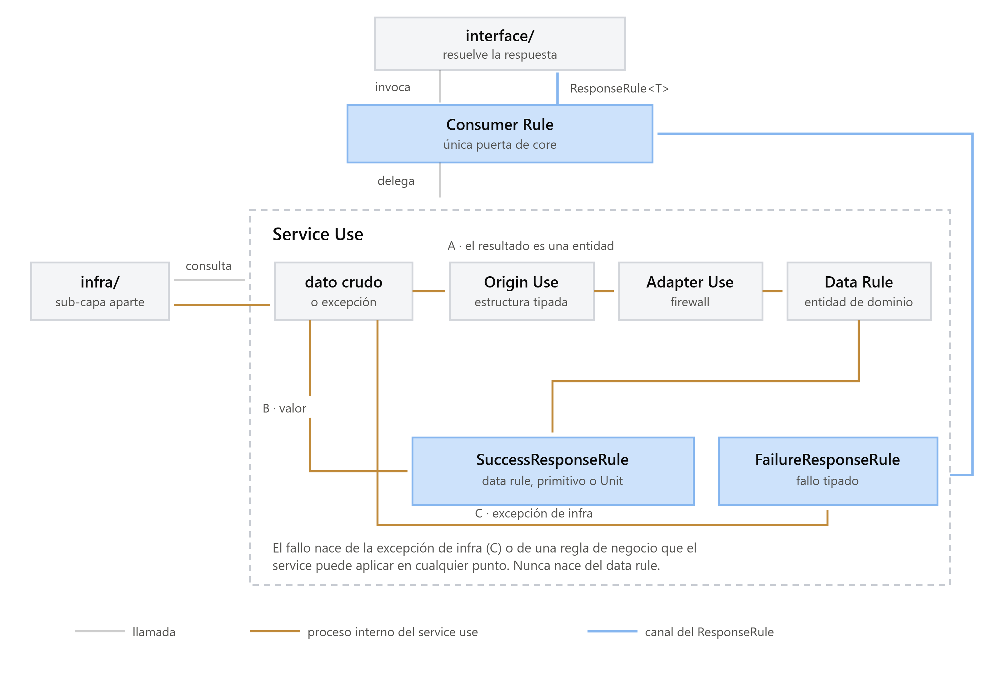

<p align="center">
  
</p>

# Kitsune Architecture

Kitsune es una arquitectura de organización estructural para proyectos de software. Define con
precisión dónde vive cada elemento del sistema, qué responsabilidad tiene y cómo se relaciona con
los demás, independientemente del lenguaje, framework o tecnología. No es un framework (no dicta
cómo ejecutar código), no es una librería (no provee utilidades) y no es una plantilla (no es un
punto de partida que se modifica a gusto libre): es una estructura obligatoria, la misma para
backend y frontend, donde solo la capa de interfaz varía según el tipo de proyecto.

## El problema que resuelve

Todo proyecto empieza ordenado. A medida que crece (más dominios, más desarrolladores, más
requerimientos) ese orden se erosiona: lógica de negocio mezclada con presentación, dependencias
cruzadas entre partes que deberían ser independientes, carpetas creadas donde resulta conveniente
y no donde corresponde, convenciones distintas entre miembros del mismo equipo. Kitsune fija reglas
organizativas desde el primer commit para que el sistema crezca sin perder coherencia.

## El concepto central: todo es un contenedor

Las capas, sub-capas, estructuras y dominios del sistema son, todos, contenedores. Lo que cambia
entre ellos no es su naturaleza sino su tipo, su posición en la jerarquía y las reglas que los
gobiernan; una vez que se entiende qué es un contenedor, se entiende toda la arquitectura. Kitsune
define exactamente **seis tipos**, en jerarquía estricta:

| Tipo | Nivel | Ejemplos | Quién lo crea |
|---|---|---|---|
| **Capa** | 1 | `configs/`, `core/`, `interface/` | Fijas, predefinidas por Kitsune |
| **Sub-capa** | 2 | `rules/`, `uses/`, `infra/` (en `core/`) | Fijas en `core/`; variables en `interface/` según proyecto |
| **Estructura** | 3 | `services/`, `origins/`, `adapters/`, `consumers/`, `responses/` | Predefinidas por Kitsune según sub-capa |
| **Dominio** | 4 | `auth/`, `tasks/`, `payments/` | Libremente, por el equipo (el único nivel funcional) |
| **Nombre** | 5 | `buttons/`, `fields/`, `overlays/` | Cuando un Dominio agrupa muchos elementos por categoría |
| **Genérico** | 6 (terminal) | `container/` | Cuando hay más de un archivo real que agrupar |

Todo contenedor (salvo el Genérico) expone su contenido a través de un **barrel file** propio: es
el único punto de acceso autorizado, y ningún archivo interno se importa directamente desde fuera.

## Estructura de un proyecto Kitsune

```
proyecto/
├── configs/     Configuración global (constantes, entornos, DI raíz)
├── core/        Lógica de negocio (idéntica en backend y frontend)
│   ├── rules/       Contratos: services, data, consumers, responses
│   ├── uses/        Implementaciones concretas: services, origins, adapters
│   └── infra/       Acceso a infraestructura (DB, storage, red)
└── interface/   Capa de presentación (varía según el tipo de proyecto)
```

## Flujo de datos

<p align="center">
  
</p>

## Repos

| Repo | Contenido |
|---|---|
| [kitsune-architecture](https://github.com/Kitsune-Architecture/kitsune-architecture) | Especificación completa (README, docs, assets, CHANGELOG). El proyecto insignia. |
| [kitsune-tools](https://github.com/Kitsune-Architecture/kitsune-tools) | Generador de código (`dart/kitsune_generator/`) y futuro linter. |
| [kitsune-examples](https://github.com/Kitsune-Architecture/kitsune-examples) | Ejemplos Flutter completos (`hello_flow`, `notes`) que implementan la spec. |

## Matriz de compatibilidad

La fuente de verdad vive en el README de [kitsune-architecture](https://github.com/Kitsune-Architecture/kitsune-architecture).
Cada repo declara ahí qué versión de la spec implementa.

## Contribuir

¿Cambios que afectan a la spec y a sus repos aguas abajo? Abrí un issue con la plantilla
**Spec change** en cualquiera de los repos de la organización: trae un checklist de qué
actualizar en cada uno.
